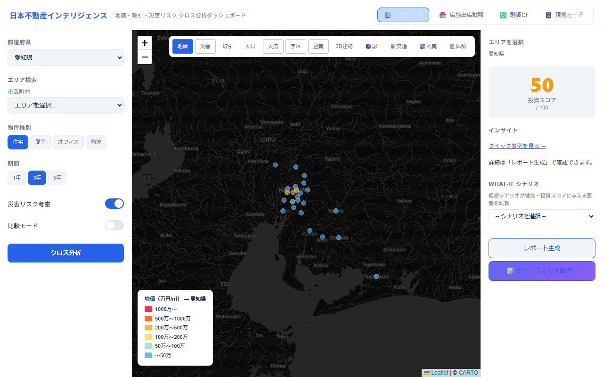

<p align="center">
  <a href="https://realestate-mcp.jp/dashboard.html?prefecture=aichi">
    
  </a>
</p>

<p align="center">
  
</p>

# Japan Real Estate Intel MCP

[](https://www.npmjs.com/package/@sugukuru/japan-real-estate-intel-mcp) [](https://www.npmjs.com/package/@sugukuru/japan-real-estate-intel-mcp) [](https://github.com/sugukurukabe/japan-real-estate-intel-mcp/actions/workflows/ci.yml) [](LICENSE) [](https://nodejs.org) [](https://github.com/sugukurukabe/japan-real-estate-intel-mcp/pkgs/container/japan-real-estate-intel-mcp) [](https://registry.modelcontextprotocol.io/v0.1/servers?search=japan-real-estate-intel) [](https://github.com/punkpeye/awesome-mcp-servers/pull/6630)

**Cross-analyze Japanese real estate data across 10 prefectures via MCP.** Land prices, disaster risk, population, foot traffic, education, corporate presence, PLATEAU 3D buildings, renovation yield, and contract support — all accessible through Claude, ChatGPT, Cursor, or any MCP client.

**Registry:** `io.github.sugukurukabe/japan-real-estate-intel-mcp` · **Growth / listings:** [docs/growth-playbook.md](docs/growth-playbook.md)

## Try in 60 seconds (Free tier — safe for demos)

Copy into Claude, Cursor, or ChatGPT after `npx @sugukuru/japan-real-estate-intel-mcp`:

```
discover_opportunities で愛知県の investment 向けエリアを探して。limit=5
```

More copy-paste prompts (3 demos, no Pro tools): **[docs/free-demo-prompts.md](docs/free-demo-prompts.md)**  
Map only: [Dashboard (Aichi)](https://realestate-mcp.jp/dashboard.html?prefecture=aichi)

> **Do not demo** PDF reports, Linear numeric sim, or contract tools on the default Free plan — they require Pro. See [tiers](src/tiers.ts) and [pro-demo-setup.md](docs/pro-demo-setup.md).

## Data freshness & trust

| Item | Detail |
|------|--------|
| **Coverage** | 10 prefectures (bundled CSV); not all 47 prefectures |
| **Update** | Run `npm run data:fetch` (requires `MLIT_API_KEY` / `ESTAT_APP_ID` for live sources) — recommend **quarterly** refresh for production |
| **Free tier** | ~50 tool calls / month (UTC) on self-hosted stdio — see `TIER_MONTHLY_TOOL_CALLS` |
| **Live MLIT** | Optional `MLIT_API_KEY` for fresher transactions in tools like `detect_arbitrage_signals` |

## Quick Install

**Claude Desktop (stdio):**
```bash
npx @sugukuru/japan-real-estate-intel-mcp
```

**Claude Desktop (remote):**
```json
{
  "mcpServers": {
    "japan-real-estate-intel": {
      "url": "https://realestate-mcp.jp/mcp",
      "headers": { "X-Api-Key": "YOUR_API_KEY" }
    }
  }
}
```

**Cursor (`.cursor/mcp.json`):**
```json
{
  "mcpServers": {
    "japan-real-estate-intel": {
      "command": "npx",
      "args": ["@sugukuru/japan-real-estate-intel-mcp"]
    }
  }
}
```

## Key Features

- **38 tools** covering market analysis, risk assessment, forecasts, renovation yield, contract support, zoning, vacancy, population outlook, macro snapshots, price triangulation arbitrage, portfolio optimization, demographic forecasting, and building code compliance audit
- **10 prefectures**: Aichi, Tokyo, Osaka, Fukuoka, Hokkaido, Kanagawa, Kyoto, Hyogo, Saitama, Chiba
- **17+ data sources**: land prices, 路線価 (rosenka), disaster hazards (earthquake + flood), population, zoning, vacancy, population projection, foot traffic, education, corporate, transport, commercial, medical, PLATEAU 3D
- **Interactive dashboard** with 2D map, 3D PLATEAU view, responsive PWA, and price triangulation panel
- **Bilingual** English + Japanese tool descriptions and UI
- **MCP Apps UI** for Claude Desktop and Cursor
- **Tiered access** (free / pro / enterprise)

**Links:** [Dashboard](https://realestate-mcp.jp/dashboard.html) | [Privacy Policy](https://realestate-mcp.jp/privacy-policy.html) | [Terms](https://realestate-mcp.jp/terms.html) | [API Docs](docs/test-prompts.md) | [Demo script](docs/demo-video-script.md)

## Author & community

| | |
|---|---|
| **Maintainer** | [@sugukurukabe](https://github.com/sugukurukabe) · npm [`@sugukuru`](https://www.npmjs.com/~sugukuru) |
| **Story** | [Implementation story (JA)](docs/implementation-story.md) · [Registry publish blog (EN)](docs/blog/registry-publish-story-en.md) |
| **Industry (Nagoya)** | [Pitch scenarios](docs/nagoya-dealer-pitch-scenarios.md) · [Follow-up sheet](docs/nagoya-pitch-followup.md) |
| **Customer stories** | [customer-stories.md](docs/customer-stories.md) _(seeking first published case)_ |
| **Contribute** | [CONTRIBUTING.md](CONTRIBUTING.md) · [Good first issues](docs/contributing-first-issues.md) |

---

## 日本語セクション (Japanese)

日本の不動産投資・仲介・開発・管理向けに、**地価・取引価格・路線価・人口統計・災害リスク・人流・教育環境・企業立地・交通・商業施設・医療福祉・3D 日照シミュレーション・町丁目実データ** をクロス分析する MCP サーバー。

**v8.0.0** — Claude公式ディレクトリ審査対応。**OAuth撤去、認証不要（authless）の公開コネクタに単純化**（Pro/Enterprise はECDSA署名ライセンスキーのみで解放）。`getRequestTier`の署名なしバイパス除去・`/api/license`のStripeセッションID化・`/metrics`鍵保護など各種セキュリティ修正。全38ツールにtitle・`idempotentHint`を付与。生成レポート/CSV/Excelを`resource_link`（HTTP: `/artifacts/:id`、stdio: `artifact://`）でダウンロード可能に。ダッシュボードのウィジェットカードにCSV/PNGエクスポートツールバーを追加。

**v7.0.0** — MCP Apps 公式SDK(`@modelcontextprotocol/ext-apps`)へ移行。2D地図・3D PLATEAUビューア・ツール別ウィジェットを React + Vite の単一ダッシュボードに統合。

**v6.15.4** — セキュリティ強化（秘密鍵除去・デモキー本番ガード・`/metrics` 認証保護）、Tier 設定補完、MCP 仕様準拠監査合格（4プリミティブ + MCP Apps + OAuth 2.1）、Glama 掲載。

**v6.15.2** — Free プラン月間ツール上限（50回/月 UTC）、Glama 用 `Dockerfile.glama`、外部掲載手順更新。

**v6.15.1** — 公式 MCP Registry 掲載（`io.github.sugukurukabe/japan-real-estate-intel-mcp`）。npm `mcpName` 整合。

**v6.15.0** — 路線価（NTA）×公示地価×取引価格の三角測量で「割安物件・相続有利エリア・市場過熱」をスキャンする `detect_arbitrage_signals` を追加。総合価値スコアにアービトラージ補正を加味。あわせて県単位マクロを一枚にまとめる `get_real_estate_macro_snapshot`（地価YoY・取引件数・人口減、任意で e-Stat 建築着工・金利プロキシ）を追加。

**v6.13.0** — 用途地域・空き家率・将来人口推計データを追加、総合価値スコア 5 軸融合、Opportunity Radar 強化、全 10 都道府県の災害リスクCSV完備。Anthropic MCP Registry / OpenAI Apps Directory 対応。


## 不動産業者の方へ

**3 分で始められるガイドはこちら: [不動産業者向けクイックスタート](docs/agent-quickstart.md)**

ダッシュボード: `https://realestate-mcp.jp/dashboard.html`

---

## はじめての方へ — クイックスタート

### ダッシュボード（ブラウザ）で試す

`open_dashboard` ツールでダッシュボードを開くと、**初回起動時に「クイックスタート」ポップアップが自動表示**されます。
6 つのサンプルシナリオをワンクリックで試せます。

| カード | 内容 |
|---|---|
| 地価トレンド予測 | 新宿区の5年後地価をAI予測。CAGR・投資シグナル付き |
| 企業立地需要分析 | 名古屋市中区のオフィス・工場需要スコアを算出 |
| ファミリー向け適性評価 | 横浜市西区の教育・安全・医療スコアを総合評価 |
| ポートフォリオ最適化 | 東京・大阪・埼玉の3エリアに投資配分を最適化 |
| What-If シナリオ分析 | 大阪市中央区で新駅開設シナリオを試算 |
| 店舗出店適地評価 | 福岡市博多区の人流・商業施設・交通データで出店適性を判定 |

> 次回から表示しない場合は「次回から表示しない」をクリック。
> いつでも右パネルの「クイック事例を見る →」リンクで再表示できます。

---

### Claude / Cursor チャットで試す

MCP Prompt `quick_start_examples` を呼び出すと、コピー＆ペーストできるサンプルコードを一覧表示します。

```
# Cursor または Claude でプロンプトを呼び出す
quick_start_examples
```

または 6 つのサンプルをそのままチャットに貼り付けて実行:

```
# 1. 地価トレンド予測
forecast_land_price_trend({ "prefecture": "東京都", "city": "新宿区", "horizon": "5y" })

# 2. 企業立地需要分析
predict_corporate_demand({ "prefecture": "愛知県", "city": "名古屋市中区", "industryType": "manufacturing" })

# 3. ファミリー向け適性評価
assess_family_friendly_score({ "prefecture": "神奈川県", "city": "横浜市西区" })

# 4. ポートフォリオ最適化（3エリア比較）
portfolio_optimizer({
  "targets": [
    { "prefecture": "東京都", "city": "新宿区", "propertyType": "office", "budgetManYen": 10000 },
    { "prefecture": "大阪府", "city": "大阪市北区", "propertyType": "commercial", "budgetManYen": 6000 },
    { "prefecture": "埼玉県", "city": "さいたま市大宮区", "propertyType": "residential", "budgetManYen": 4000 }
  ],
  "riskTolerance": "medium",
  "investmentHorizon": "5y",
  "optimizeFor": "risk_adjusted"
})

# 5. What-If シナリオ分析
scenario_what_if({ "prefecture": "大阪府", "city": "大阪市中央区", "scenario": "new_station", "scale": "large" })

# 6. 店舗出店適地評価
evaluate_store_location({ "city": "福岡市博多区", "storeType": "cafe", "targetCustomer": "office_worker" })
```

---

> **履歴メモ** 以下の「What's New」各節（v5 / v4 / v2.x など）は、**当該バージョン当時のスナップショット**です。ツール数・テスト数・対応範囲はその後拡張されています。**現行の正**は文書冒頭（Key Features / 日本語の v6.x）、`server.json` の `tools`、および `pnpm test` の結果を参照してください。

## v5.0.0 What's New — 10 都道府県体制 + ポートフォリオ最適化

| 都道府県 | 取引 | 人口・災害 | 人流 | 教育 | 企業 | 犯罪 | 交通 | 商業 | 医療 | 3D PLATEAU |
|---|---|---|---|---|---|---|---|---|---|---|
| 愛知県 | ✓ | ✓ | ✓ | ✓ | ✓ | ✓ | ✓ | ✓ | ✓ | ✓ |
| 東京都 | ✓ | ✓ | ✓ | ✓ | ✓ | ✓ | ✓ | ✓ | ✓ | ✓ |
| 大阪府 | ✓ | ✓ | ✓ | ✓ | ✓ | ✓ | ✓ | ✓ | ✓ | ✓ |
| 神奈川県 | ✓ | ✓ | ✓ | ✓ | ✓ | ✓ | ✓ | ✓ | ✓ | - |
| 福岡県 | ✓ | ✓ | ✓ | ✓ | ✓ | ✓ | ✓ | ✓ | ✓ | - |
| 北海道 | ✓ | ✓ | ✓ | ✓ | ✓ | ✓ | ✓ | ✓ | ✓ | - |
| 京都府 | ✓ | ✓ | ✓ | ✓ | ✓ | ✓ | ✓ | ✓ | ✓ | - |
| 兵庫県 | ✓ | ✓ | ✓ | ✓ | ✓ | ✓ | ✓ | ✓ | ✓ | - |
| 埼玉県 🆕 | ✓ | ✓ | ✓ | ✓ | ✓ | ✓ | ✓ | ✓ | ✓ | - |
| 千葉県 🆕 | ✓ | ✓ | ✓ | ✓ | ✓ | ✓ | ✓ | ✓ | ✓ | - |

### 新ツール（v5.0）

| ツール | 概要 |
|---|---|
| `portfolio_optimizer` | 最大 5 エリアを比較し、期待リターン・リスクスコア・流動性・分散スコア・シャープレシオを算出。最適配分比率を提案 |

```
portfolio_optimizer({
  targets: [
    { prefecture: "東京都", city: "新宿区", propertyType: "office", budgetManYen: 10000 },
    { prefecture: "埼玉県", city: "さいたま市大宮区", propertyType: "residential", budgetManYen: 5000 },
    { prefecture: "千葉県", city: "千葉市中央区", propertyType: "commercial", budgetManYen: 3000 }
  ],
  riskTolerance: "medium",
  investmentHorizon: "5y",
  optimizeFor: "risk_adjusted"
})
```

### v5.1.0 完成度向上パッチ

- `LoaderCapabilities` に `transactions: boolean` フィールドを追加（全 10 ローダー対応）
- `portfolio_optimization` MCP Prompt を追加（計 7 プロンプト）
- ダッシュボードに「ポートフォリオ最適化」ボタン + JSON 生成 UI を追加
- 埼玉・千葉の earthquake/flood/municipalities データを loader 互換形式に変換
- national-expansion.test.ts に埼玉・千葉のパラメータ化テストを追加（v5.1 当時のテスト総数記録: 421 本）
- schemas.test.ts に `PortfolioOptimizerInput` バリデーションテスト 7 件を追加

---

## v4.0.0 What's New — Capability Parity + Intelligence Layer


| 都道府県 | 地価・取引 | 人口・災害 | 人流 | 教育 | 企業 | 犯罪 | 交通 | 商業 | 医療 | 3D |

|---|---|---|---|---|---|---|---|---|---|---|

| 愛知県 | ✓ | ✓ | ✓ | ✓ | ✓ | ✓ | ✓ | ✓ | ✓ | ✓ |

| 東京都 | ✓ | ✓ | ✓ | ✓ | ✓ | ✓ | ✓ | ✓ | ✓ | - |

| 大阪府 | ✓ | ✓ | ✓ | ✓ | ✓ | ✓ | ✓ | ✓ | ✓ | - |

| 神奈川県 | ✓ | ✓ | ✓ | ✓ | ✓ | ✓ | ✓ | ✓ | ✓ | - |

| 福岡県 | ✓ | ✓ | ✓ | ✓ | ✓ | ✓ | ✓ | ✓ | ✓ | - |

| 北海道 | ✓ | ✓ | ✓ | ✓ | ✓ | ✓ | ✓ | ✓ | ✓ | - |

| 京都府 | ✓ | ✓ | ✓ | ✓ | ✓ | ✓ | ✓ | ✓ | ✓ | - |

| 兵庫県 | ✓ | ✓ | ✓ | ✓ | ✓ | ✓ | ✓ | ✓ | ✓ | - |


### 新ツール（v4.0）


| ツール | 概要 |

|---|---|

| `forecast_land_price_trend` | 線形回帰・移動平均で将来地価を予測。CAGR・信頼区間・投資シグナル（buy/hold/caution） |

| `scenario_what_if` | 新駅・大型商業施設・人口変動など 7 シナリオが地価・投資スコアに与える影響を試算 |


```

forecast_land_price_trend({ prefecture: "東京都", city: "千代田区", horizon: "5y" })

scenario_what_if({ prefecture: "大阪府", city: "大阪市中央区", scenario: "new_station", scale: "large" })

```


---


## v2.9.0 What's New — 8 都道府県体制 (National Expansion)


| 区分 | 都道府県 | 対応機能 |

|---|---|---|

| 完全対応 | 愛知県 | 地価・取引・人口・災害リスク・人流・教育・企業・交通・商業・医療・3D・町丁目 |

| 拡張対応（v4.0） | 東京都 | 全データ対応（地価・人流・教育・企業・犯罪・交通・商業・医療・町丁目） |

| 拡張対応（v4.0） | 大阪府 | 全データ対応 |

| 拡張対応（v4.0） | 神奈川県 | 全データ対応 |

| 拡張対応（v4.0） | 福岡県 | 全データ対応 |

| 拡張対応（v4.0） | 北海道 | 全データ対応 |

| 拡張対応（v4.0） | 京都府 | 全データ対応 |

| 拡張対応（v4.0） | 兵庫県 | 全データ対応 |


### 使用例


```

compare_prefectures({ prefectures: ["愛知県", "福岡県", "神奈川県"], metrics: ["land_price", "earthquake_risk"] })

drill_down_local_analysis({ prefecture: "兵庫県", city: "神戸市中央区" })

open_dashboard({ prefecture: "福岡県", initialMode: "investment" })

```


---


## v2.8.0 What's New — Dual-Mode Dashboard


| 機能 | 詳細 |

|---|---|

| 🏢 不動産投資モード | 地価・災害リスク・人流・教育・企業を優先表示（デフォルト） |

| 🏪 店舗出店戦略モード | 人流・交通・商業施設・医療を優先表示。出店評価パネルを最上部に表示 |

| モード切替ボタン | ヘッダー右上に常時表示、ワンクリックで即時切替 |

| レーダーチャート軸の動的並び替え | 店舗モードでは人流→交通→商業→医療を上位に自動並び替え |

| 出店適性スコア | 店舗モード時に人流・交通・商業施設を重み付けしたスコアをインサイトパネルに表示 |

| `open_dashboard` `initialMode` パラメータ | `investment` / `store` で初期モードを AI 側から指定可能、`?mode=` URL パラメータにも対応 |


### 使用例（AI から店舗モードで開く）


```

open_dashboard({ prefecture: "愛知県", initialMode: "store" })

```


**v2.7** で実データ統合。MLIT 不動産情報ライブラリ API（取引価格）と e-Stat 国勢調査 API から実データを取得し、既存 CSV を更新する CLI ツール `npm run data:fetch` を追加。


## 実データセットアップ（v2.7.0）


API キーを設定すると、`npm run data:fetch` で **ローダーに登録されている都道府県（現行 10 都道府県）** の MLIT / e-Stat 系データを更新できます（`.env` に `MLIT_API_KEY` / `ESTAT_APP_ID` 等が必要です）。


### 1. API キー取得


| API | 申請URL | 用途 |

|---|---|---|

| MLIT 不動産情報ライブラリ | https://www.reinfolib.mlit.go.jp/help/apiManual/ | 取引価格・地価 |

| e-Stat (政府統計) | https://www.e-stat.go.jp/api/ | 国勢調査人口 |


### 2. 環境変数設定


```bash

cp .env.example .env

# .env を開いて API キーを記入

```


### 3. データ取得実行


```bash

# 愛知県 2025年

npm run data:fetch -- --prefecture aichi --year 2025


# 全都府県一括

npm run data:fetch:all


# 特定四半期

npm run data:fetch -- --prefecture tokyo --year 2025 --quarter 2

```


キーが未設定のソースはスキップされ、既存 CSV は変更されません。


### 4. MCP サーバー再起動


```bash

npm run build

node dist/index.js  # または npm start

```


---


## v2.7.0 What's New


| 追加/変更 | 詳細 |

|---|---|

| **MLIT API クライアント** | `src/api-client/mlit.ts` — XIT001 取引価格取得・CSV 変換（city×district 単位で median 集計） |

| **e-Stat API クライアント** | `src/api-client/estat.ts` — 国勢調査人口・世帯数取得・CSV 変換 |

| **実データ取得 CLI** | `scripts/fetch-real-data.ts` — `npm run data:fetch` で **当時から** 対象県の実データを一括更新（現行スクリプトは `listAvailable()` に連動し **10 都道府県** を対象にできる） |

| **型定義** | `src/api-client/types.ts` — MLIT/e-Stat レスポンス型 + CSV 行型 |

| **.env.example** | API キー設定テンプレート追加 |

| テスト総数 | **210 → 235 テスト**（v2.7 当時） |

| tsx | `devDependencies` に追加（TypeScript 直接実行） |


## v2.5.0 What's New


| 追加/変更 | 詳細 |

|---|---|

| **カスタムエラー層** | `McpBaseError` 継承: `DataNotFoundError`, `InvalidPrefectureError`, `CapabilityNotAvailableError`, `ValidationError` |

| **構造化ロギング (pino)** | `src/logger.ts` — stderr 書き込み、`LOG_LEVEL` env 対応、`toolLogger` (tool/prefecture/duration_ms) |

| **`withErrorHandling()` ラッパー** | 当時登録済みの全ツールに適用。エラー時 `isError: true` レスポンス + 構造化ログ |

| **HTTP サーバー堅牢化** | `helmet` セキュリティヘッダー、10MB ボディ制限、`API_KEY` 認証、30分タイムアウト、SIGTERM/SIGINT グレースフルシャットダウン |

| **ESLint + Prettier** | `eslint.config.mjs` (flat config) + `.prettierrc` 導入 |

| **カバレッジ計測** | `pnpm test:coverage` — vitest v8 coverage (70% 閾値) |

| **CodeQL セキュリティ分析** | `.github/workflows/codeql.yml` — 週次実行 |

| **CI 拡張** | ESLint ステップ + `npm audit` + カバレッジアーティファクト + Step Summary |

| **ドキュメント** | `CHANGELOG.md`, `CONTRIBUTING.md`, `SECURITY.md` 追加 |

| テスト総数 | **174 → 185+ テスト** |


## v2.4.0 What's New


| 追加/変更 | 詳細 |

|---|---|

| **町丁目実データ対応** | `NeighborhoodRecord`（人口・世帯・年齢構成・昼夜間人口比）を愛知 70+・東京 15+・大阪 25+ 町丁目で搭載 |

| **drill_down 実データ昇格** | `neighborhood` 指定時に町丁目レベルの人口・世帯・高齢化率・昼夜間人口比を実データで返却 |

| **store_location 町丁目精度** | 町丁目データがある場合、人口・昼夜間人口比を実データベースでスコアリング |

| **大阪府ローダー追加** | 地価・人口・浸水・地震・自治体境界・町丁目データ（3 都府県体制） |

| **Three.js 3D ビューア** | `ui/dashboard-3d.html` — 名駅周辺の建物を 3D 描画。OrbitControls + 朝/正午/夕方の影シミュレーション |

| **3D ダッシュボードリソース** | `ui://japan-real-estate-intel/dashboard-3d` で 3D ビューアにアクセス |

| 合計ツール数 | **10 ツール** |

| 対応都道府県 | **8（愛知・東京・大阪・福岡・北海道・神奈川・京都・兵庫）** |

| テスト総数 | **149 → 174 テスト** |


## v2.3.0 What's New


| 追加/変更 | 詳細 |

|---|---|

| **`simulate_landscape_impact` ツール新設** | SunCalc 太陽位置計算 + PLATEAU 3D 建物データから影ポリゴンを生成。日照時間推定・影面積・高影響建物リスト・Markdown レポート |

| **影レイヤー追加** | ダッシュボードに 🌑影 レイヤー。建物ごとの影ポリゴンを半透明で描画 |

| **時刻プリセット** | 朝 8:00 / 正午 12:00 / 夕方 17:00 の 3 プリセットで時刻別影シミュレーション |

| **日照推定アルゴリズム** | 8:00〜16:00 の 5 時点で太陽高度 > 10° & 影外判定 → 日照時間概算 |

| 合計ツール数 | **9 → 10 ツール** |

| テスト総数 | **130 → 149 テスト** |


## v2.2.0 What's New


| 追加/変更 | 詳細 |

|---|---|

| **`evaluate_store_location` ツール新設** | コンビニ/ファミレス/カフェ/ドラッグストア/スーパーの出店適地評価。店舗タイプ別重み付け・競合分析・差別化提案・Markdown レポート |

| **3 データソース統合** | 交通利便性（駅・路線・乗降客数）、商業施設（SC/CVS/飲食等）、医療福祉（病院/クリニック/薬局等）を全ツールに統合 |

| **`cross_analyze` に 3 フラグ追加** | `includeTransport` / `includeCommercial` / `includeMedical` でオプトイン |

| **比較メトリクス 8 軸化** | `compare_prefectures` の metrics に `transport` / `commercial` / `medical` を追加。レーダーチャート 8 軸対応 |

| **ドリルダウン拡張** | `drill_down_local_analysis` に交通スコア・商業密度・医療充実度を追加 |

| **ダッシュボード 3 新レイヤー** | 交通（🚉 teal）/ 商業施設（🏬 amber）/ 医療（🏥 pink）レイヤー追加 |

| **店舗評価モード** | ドリルダウンパネルに storeType セレクタ付き店舗評価モードトグル追加 |

| 合計ツール数 | **8 → 9 ツール** |

| テスト総数 | **93 → 130 テスト** |


### 店舗タイプ別重み付け表


| 指標 | コンビニ | ファミレス | カフェ | ドラッグストア | スーパー |

|---|:---:|:---:|:---:|:---:|:---:|

| 人流 | 35% | 20% | 40% | 25% | 25% |

| 人口密度 | 25% | 30% | 20% | 35% | 35% |

| 災害リスク | 15% | 20% | 10% | 15% | 20% |

| 競合密度 | 20% | 15% | 20% | 15% | 10% |

| 交通利便性 | 5% | 10% | 10% | 10% | 10% |

| 教育環境 | - | 5% | - | - | - |


## v2.1.0 What's New


| 追加/変更 | 詳細 |

|---|---|

| **`compare_prefectures` ツール追加** | 2〜5 都道府県を価格・リスク・人流・教育・企業で比較。レーダーチャートデータ・ランキング・差分ハイライト・Markdown レポート出力 |

| **`drill_down_local_analysis` ツール追加** | 市区町村・町丁目レベルのドリルダウン。地価・人口・リスク・人流・競合密度をローカル不動産屋向けにまとめる |

| **全ツールに `neighborhood` フィールド追加** | 町丁目名をラベルとしてレポートに反映（v2.1 は label only、実データ対応は v2.2 以降） |

| **比較モードダッシュボード** | 比較モード ON で地図を 2 分割。SVG レーダーチャート・ランキングテーブル・bestFor が insight パネルに表示される |

| **市区町村クリック → ドリルダウンパネル** | 地図上クリックで詳細メトリクスパネルが展開。町丁目入力欄も搭載 |

| 合計ツール数 | **6 → 8 ツール** |


## v2.0.0 Breaking Changes


| 変更 | 詳細 |

|---|---|

| 全ツールに `prefecture` パラメータ追加 | デフォルト: `"愛知県"` |

| `cross_analyze_with_human_flow` 廃止 | `cross_analyze_real_estate_market` に `includeHumanFlow` フラグとして統合 |

| Resource URI 変更 | `realestate://land-price/{prefecture}/{area}` 形式に |

| データディレクトリ変更 | `data/aichi/`, `data/tokyo/` に分離 |

| 出力に optional フィールド追加 | `humanFlow`, `realDemandScore`, `educationSummary`, `corporateSummary` |


## 「今までなかった」独自価値


| データ×データ | 実現する分析 | 業界インパクト |

|---|---|---|

| 地価 × 人流 × 災害リスク | 実需要に基づく空室リスク予測 | 「人が本当に来るか？」を数値化 |

| 住宅価格 × 学区偏差値 × 犯罪統計 | ファミリー物件の真の資産価値 | 子育て世帯向け最強の投資判断 |

| オフィス価格 × 企業集積 × 通勤時間 | 法人需要の精密予測 | オフィス・物流投資で差別化 |

| 地価 × PLATEAU 3D建物高さ × 影 | 景観・日照シミュレーション | 開発事業者への視覚的説得力 |


## 都道府県 Capabilities マトリクス


| 機能 | 愛知 | 東京 | 大阪 | 福岡 | 北海道 | 神奈川 | 京都 | 兵庫 |

|---|:---:|:---:|:---:|:---:|:---:|:---:|:---:|:---:|

| 地価公示 | YES | YES | YES | YES | YES | YES | YES | YES |

| 不動産取引 | YES | - | - | - | - | - | - | - |

| 人口統計 | YES | YES | YES | YES | YES | YES | YES | YES |

| 浸水想定 | YES | YES | YES | YES | YES | YES | YES | YES |

| 土砂災害 | YES | - | - | - | - | - | - | - |

| 地震想定 | YES | YES | YES | YES | YES | YES | YES | YES |

| 市区町村境界 | YES | YES | YES | YES | YES | YES | YES | YES |

| 人流データ | YES | - | - | - | - | - | - | - |

| 教育環境 | YES | - | - | - | - | - | - | - |

| 企業立地 | YES | - | - | - | - | - | - | - |

| 犯罪統計 | YES | - | - | - | - | - | - | - |

| PLATEAU 3D | YES | - | - | - | - | - | - | - |

| 交通利便性 | YES | - | - | - | - | - | - | - |

| 商業施設 | YES | - | - | - | - | - | - | - |

| 医療福祉 | YES | - | - | - | - | - | - | - |

| **町丁目データ** | **YES** | **YES** | **YES** | **YES** | **YES** | **YES** | **YES** | **YES** |


## 特徴


- **38 ツール**: 市場クロス分析 / リスク / ファミリー / 法人需要 / レポート / ダッシュボード / 都道府県比較 / ドリルダウン / 出店 / 日照シミュ / 予測・What-If / PF 最適化 / リノベ・契約・用途地域・空き家率・人口推計・マクロ・アービトラージ / 人口動態予測 / 建築基準適合監査 等（詳細は冒頭 Key Features）

- **12 レイヤーダッシュボード + 3D ビューア**: 地価 / 災害リスク / 取引 / 人口 / 人流 / 学区 / 企業密度 / 3D 建物 / 交通 / 商業施設 / 医療 / 影 + **Three.js 3D ビューア**

- **10 都道府県対応**: 愛知県（フル機能・名古屋市町丁目データ）/ 東京都・大阪府・福岡県・北海道・神奈川県・京都府・兵庫県・埼玉県・千葉県（標準対応）

- **町丁目実データ**: 名古屋市を中心に、町丁目レベルの人口・世帯・計画データ等（対象エリアはデータソースに依存）

- **都道府県セレクタ**: ダッシュボード上で **10 都道府県**を切り替え、比較モードで任意の 2 エリアを並列表示

- **比較モード（v2.1 フル機能）**: 地図 2 分割 + SVG レーダーチャート + ランキングテーブル + bestFor 表示

- **ドリルダウンパネル（v2.1 new）**: 市区町村クリックで詳細パネル展開。町丁目ラベル入力対応

- **stdio + Streamable HTTP**: 両トランスポート対応

- **TypeScript strict + Zod**: 型安全な入出力スキーマ

- **プラガブル**: `BaseLoader` を継承して新県を追加


## クイックスタート


```bash

git clone https://github.com/sugukurukabe/japan-real-estate-intel-mcp.git

cd japan-real-estate-intel-mcp

pnpm install

pnpm build

```


### stdio（ローカル）


```bash

node dist/index.js

```


### Streamable HTTP（リモート）


```bash

node dist/http.js

# → http://0.0.0.0:3100/mcp

```


## クライアント設定


### Claude Desktop


```json

{

  "mcpServers": {

    "japan-real-estate-intel": {

      "command": "node",

      "args": ["dist/index.js"],

      "cwd": "/path/to/japan-real-estate-intel-mcp"

    }

  }

}

```


### Cursor (`.cursor/mcp.json`)


```json

{

  "mcpServers": {

    "japan-real-estate-intel": {

      "command": "node",

      "args": ["dist/index.js"],

      "cwd": "/path/to/japan-real-estate-intel-mcp"

    }

  }

}

```


## ツール一覧（参考: v2.3 時点の 10 本）

> **現行**は **38 ツール**です。完全な一覧はリポジトリ直下の `server.json` の `tools` 配列、または `pnpm test` が通る `tests/server_json_tools_sync.test.ts` を参照してください。

### `cross_analyze_real_estate_market`


都道府県内エリアの不動産市場をクロス分析。`includeHumanFlow` / `includeEducation` / `includeCorporate` / `includeTransport` / `includeCommercial` / `includeMedical` フラグで付加情報をオプトイン。


| パラメータ | 型 | デフォルト | 説明 |

|---|---|---|---|

| `prefecture` | string | `"愛知県"` | 都道府県名 |

| `area` | string | - | エリア名 |

| `propertyType` | enum | - | residential / commercial / logistics / office / mixed |

| `timeRange` | enum | - | 1y / 3y / 5y |

| `includeRisk` | boolean | `true` | 災害リスクを含むか |

| `includeHumanFlow` | boolean | `true` | 人流データを含むか |

| `includeEducation` | boolean | `false` | 教育データを含むか |

| `includeCorporate` | boolean | `false` | 企業データを含むか |

| `includeTransport` | boolean | `false` | 交通利便性データを含むか *(v2.2)* |

| `includeCommercial` | boolean | `false` | 商業施設データを含むか *(v2.2)* |

| `includeMedical` | boolean | `false` | 医療施設データを含むか *(v2.2)* |


ローダーがデータセットを提供しない場合、該当フィールドは `undefined` になり、`keyInsights` 等に **「当該都道府県では未提供」** の旨が表示されます。


### `assess_property_risk`


特定住所の浸水・土砂・地震リスクを評価し、リスクスコアと価格調整率を算出。


### `assess_family_friendly_score`


学区・教育環境・犯罪統計を加味したファミリー物件評価。子育て世帯向け資産価値を算出。


### `predict_corporate_demand`


企業立地・事業所統計・通勤データで法人需要を予測。


### `generate_area_report`


投資/開発/賃貸/管理レポートを Markdown 形式で生成。


### `open_dashboard`


12 レイヤーの不動産ダッシュボードを起動。比較モード（地図 2 分割 + SVG レーダー）、ドリルダウンパネル、影シミュレーション（時刻プリセット）を搭載。


### `compare_prefectures` *(v2.1 新設)*


2〜5 都道府県を複数メトリクスで比較分析。レーダーチャート・ランキング・差分ハイライト・bestFor を返す。


| パラメータ | 型 | デフォルト | 説明 |

|---|---|---|---|

| `prefectures` | string[] (2-5) | - | 比較対象都道府県名リスト |

| `area` | string | optional | 代表エリア（省略時: 愛知→名古屋市中区、東京→千代田区） |

| `neighborhood` | string | optional | 町丁目ラベル（v2.1 はレポートへの反映のみ） |

| `propertyType` | enum | `"mixed"` | residential / commercial / logistics / office / mixed |

| `metrics` | enum[] | `["price","risk","investment"]` | 比較指標（price/risk/humanFlow/education/corporate/investment/transport/commercial/medical） |

| `includeMarkdown` | boolean | `true` | Markdown レポートを含むか |


**出力**: `scores[]`（各都道府県スコア）, `ranking[]`, `radarData[]`（SVG 用正規化値）, `diffs[]`（差分ハイライト）, `bestFor`（投資/安全/成長別おすすめ）, `markdownReport`


### `drill_down_local_analysis` *(v2.1 新設)*


市区町村・町丁目レベルのドリルダウン分析。ローカル不動産屋向けセールスピッチと Markdown レポートを生成。


| パラメータ | 型 | デフォルト | 説明 |

|---|---|---|---|

| `prefecture` | string | `"愛知県"` | 都道府県名 |

| `city` | string | - | 市区町村名（例: `"名古屋市中村区"`） |

| `neighborhood` | string | optional | 町丁目（例: `"名駅南1丁目"`）。v2.1 はラベルのみ |

| `focus` | enum | `"all"` | price / risk / demand / all |


**出力**: `pricePerSqm`, `population`, `riskScore`, `floodLevel`, `humanFlowScore`, `transportScore`, `commercialDensity`, `medicalDensity`, `competitorDensity`, `localPitch`（セールスピッチ文）, `keyInsights[]`, `markdownReport`, `households?`, `avgAge?`, `childRatio?`, `elderlyRatio?`, `daytimePopRatio?`, `popDensity?`, `neighborhoodDataAvailable?`


> **v2.4 新機能**: `neighborhood` 指定時に町丁目実データ（人口・世帯・年齢構成・昼夜間人口比）を返却します。データが無い場合は市区町村レベルの推定値を使用します。


### `evaluate_store_location` *(v2.2 新設)*


コンビニ・ファミレス・カフェ・ドラッグストア・スーパーの出店適地評価。店舗タイプ別に重み付けを自動調整し、人口・人流・リスク・競合・交通・教育・商業施設・医療の 8 軸でスコアリング。


| パラメータ | 型 | デフォルト | 説明 |

|---|---|---|---|

| `prefecture` | string | `"愛知県"` | 都道府県名 |

| `city` | string | - | 市区町村名 |

| `neighborhood` | string | optional | 町丁目ラベル |

| `storeType` | enum | - | convenience / family_restaurant / cafe / drugstore / supermarket |

| `radiusM` | number | `500` | 競合・施設検索半径（m） |

| `customWeights` | Record | optional | カスタム重み付け（省略時はタイプ別デフォルト） |

| `includeMarkdown` | boolean | `true` | Markdown レポートを含むか |


**出力**: `overallScore (0-100)`, `breakdown`（8 軸スコア）, `keyCompetitors[]`（距離・チェーン名・強度・弱点）, `differentiationSuggestions[]`（AI 差別化提案）, `keyInsights[]`, `markdownReport`


### `simulate_landscape_impact` *(v2.3 新設)*


SunCalc 太陽位置計算 + PLATEAU 3D 建物データから指定地点の日照・影をシミュレーション。影ポリゴン（[lat,lng][] 配列）を返すため、ダッシュボードや GIS に直接描画可能。


| パラメータ | 型 | デフォルト | 説明 |

|---|---|---|---|

| `prefecture` | string | `"愛知県"` | 都道府県名 |

| `lat` | number | - | 対象地点の緯度 |

| `lng` | number | - | 対象地点の経度 |

| `dateTime` | string | 現在時刻 | シミュレーション日時（ISO 8601） |

| `timePreset` | enum | optional | morning(8:00) / noon(12:00) / evening(17:00) |

| `radiusM` | number | `500` | 建物検索半径（m） |

| `includeMarkdown` | boolean | `true` | Markdown レポートを含むか |


**出力**: `sunPosition`（方位角・高度）, `nearbyBuildingCount`, `maxHeight`, `avgHeight`, `totalShadowAreaSqm`, `sunlightHoursEstimate`, `shadowPolygons[]`（建物名・高さ・影長・ポリゴン座標）, `highImpactBuildings[]`, `keyInsights[]`, `markdownReport`


## Resources（v2.0 URI パターン）


| URI | 説明 |

|---|---|

| `realestate://land-price/{prefecture}/{area}` | 地価公示データ |

| `hazard://flood/{prefecture}/{area}` | 浸水想定区域 GeoJSON |

| `stats://population-trend/{prefecture}/{area}` | 人口統計 |

| `ui://japan-real-estate-intel/dashboard` | ダッシュボード HTML |


例: `realestate://land-price/aichi/名古屋市中区`, `realestate://land-price/tokyo/世田谷区`


## 都道府県の追加手順


新しい県を追加する場合:


1. `data/<key>/` に最低限のファイルを配置:

   - `land_price.csv`, `population.csv`, `flood.geojson`, `earthquake.json`, `municipalities.topojson`

2. `src/data-loaders/<key>-loader.ts` を作成（`BaseLoader` を継承、`capabilities` を宣言）

3. `src/data-loaders/index.ts` で `registerLoader(new XxxLoader())` を 1 行追加

4. `src/prefecture/resolver.ts` の `PREFECTURE_KEYS` にエイリアスを追加


それだけで `prefecture: "大阪府"` が全ツールで動作します。


## データ出典


| データ | 出典 | 取得日 |

|---|---|---|

| 地価公示 | 国土交通省 | 2025-12-01 |

| 不動産取引価格 | 国土交通省 | 2025-12-01 |

| 浸水・土砂災害 | 国土交通省ハザードマップ | 2025-12-01 |

| 地震想定 | 内閣府 | 2025-12-01 |

| 人口統計 | 総務省 e-Stat | 2025-12-01 |

| 人流統計 | 国土交通省「全国うごき統計」| 2025-12-01 |

| 教育データ | 愛知県教育委員会 + e-Stat | 2025-12-01 |

| 事業所統計 | 総務省 e-Stat | 2025-12-01 |

| 犯罪統計 | 愛知県警察オープンデータ | 2025-12-01 |

| 3D都市モデル | 国土交通省 PLATEAU | 2025-12-01 |

| 交通利便性 | 国土交通省交通データ + JR/私鉄/市営地下鉄 | 2026-05-01 |

| 商業施設 | 商業統計 + チェーン店立地データ | 2026-05-01 |

| 医療福祉施設 | 厚労省オープンデータ | 2026-05-01 |


**データについて**: 各データは上記の取得日時点の本番データです。投資判断・契約判断には専門家へのご相談を併せてお願いします。


## 開発


```bash

pnpm install

pnpm dev          # TypeScript watch

pnpm build:ui     # ダッシュボード再ビルド

pnpm test         # Vitest (696 tests, 50 files)

pnpm lint         # 型チェック

```


## ロードマップ

### v6.15.0（現バージョン）

- 路線価（NTA）×公示地価×取引価格の価格トライアングル武器化パック
- `detect_arbitrage_signals` ツール — 割安・相続有利・市場過熱スキャン
- `get_real_estate_macro_snapshot` ツール — 県単位マクロ（地価 YoY・取引件数・人口減、任意で建築着工・金利プロキシ）
- 総合価値スコアにアービトラージ補正加味
- UI に価格トライアングルパネル追加
- 用途地域・空き家率・将来人口推計データ
- 10 都道府県 / 38 ツール（`server.json` と実行時で一致） / 696+ テスト（55 ファイル）

## ライセンス

MIT

