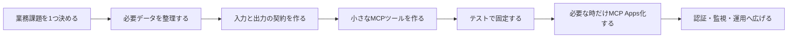
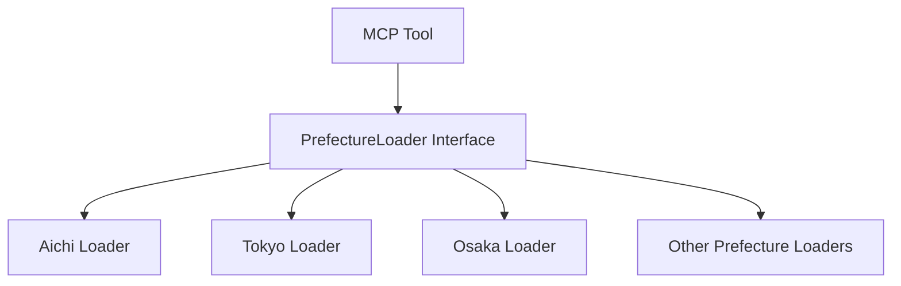

# MCP 構築の最高の指南書

> Japan Real Estate Intel MCP を 0 から本番運用レベルまで積み上げた実績をもとに、MCP サーバー、MCP Apps、ChatGPT / Claude / Cursor 連携を作るための実践ガイドとしてまとめた資料です。

---

## 1. この資料の立ち位置

MCP は「AI に外部データや業務機能を安全に使わせるための標準プロトコル」です。

このプロジェクトでは、MCP を使って日本の不動産データを AI から扱えるようにしました。現在の実装では、地価・取引価格・路線価・人口・災害リスク・人流・教育・企業立地・交通・商業・医療・PLATEAU 3D などを横断し、Claude / ChatGPT / Cursor から利用できる MCP サーバーになっています。

この資料は、抽象論ではなく、次の実装実績から得た教訓だけを扱います。

| 実績 | 内容 |
|---|---|
| 対応クライアント | Claude Desktop、ChatGPT Apps、Cursor、HTTP MCP |
| 実行方式 | stdio / Streamable HTTP 相当の remote MCP |
| 対応都道府県 | 10 都道府県 |
| データソース | 17 種類以上 |
| ツール | 実行時 **33** 本（`server.json` の `tools` と一致。ChatGPT 向け `search` / `fetch` / `quick_visual_summary` 等を含む） |
| UI | MCP Apps による `ui://` ダッシュボード、2D 地図、PLATEAU 3D、価格トライアングル、レーダーチャート |
| 品質確認 | Vitest 全体で 50 ファイル / 696 テスト通過済み |
| 運用要素 | OAuth、レートリミット、構造化ログ、Prometheus、Sentry、Docker、Registry / Apps Directory 対応 |

---

## 2. 結論：MCP 構築で一番大事なこと

MCP 構築で一番大事なのは、**AI に何でも渡すことではなく、AI が安全に使える業務単位の道具へ分解すること**です。

このプロジェクトでは、最初から巨大な「不動産AI」を作ったわけではありません。最初は愛知県の地価・人口・災害リスクを読む小さな MCP から始めました。その後、都道府県ローダー、ツール、リソース、プロンプト、MCP Apps UI、認証、監視、テストを段階的に積み上げました。

つまり、成功パターンは次です。

---

## 3. MCP の基本設計：Tools / Resources / Prompts / Apps

MCP を作るときは、最初に機能を 4 種類へ分けます。

| 種類 | 役割 | このプロジェクトでの例 | 判断基準 |
|---|---|---|---|
| Tool | AI が実行する計算・分析 | `cross_analyze_real_estate_market`, `detect_arbitrage_signals` | 入力に応じて結果が変わる処理 |
| Resource | AI が読むデータ | `realestate://land-price/{prefecture}/{area}` | 参照データとして安定しているもの |
| Prompt | よく使う業務手順 | `investment_report`, `arbitrage_scan` | ユーザーに毎回説明させたくない定型ワークフロー |
| App | 地図・グラフ・フォームなどの画面 | `ui://japan-real-estate-intel/dashboard` | テキストだけでは理解しにくいもの |

重要なのは、**最初から全部 App にしないこと**です。

価格やリスクのように表で十分伝わるものは Tool の Markdown 出力で足ります。一方、地図、3D、価格トライアングル、レーダーチャートのように「見た方が早い」ものだけ MCP Apps にします。

---

## 4. 実装の黄金ルート：0 から 10 まで

### Step 0: 何を解決する MCP かを一文で言う

悪い例：

> 不動産AIを作る

良い例：

> AI が日本の不動産データを取得し、投資判断・リスク確認・契約支援を自然言語で実行できるようにする

この一文が曖昧だと、ツール名、入力スキーマ、UI、テスト、ドキュメントが全部ぶれます。

### Step 1: 最小データで動かす

最初から全国対応しません。このプロジェクトも最初は愛知県だけでした。

最初の MCP は、次の条件を満たせば十分です。

- 1 地域
- 1 データソース
- 1 ツール
- 1 テスト
- 1 クライアント接続

この段階で「AI がツールを呼べる」「結果を説明できる」「壊れたらテストで分かる」ことを確認します。

### Step 2: 入力と出力を Zod で固定する

MCP はプロトコル境界です。境界では曖昧な JSON を受け取らず、必ずスキーマで検証します。

このプロジェクトでは `src/schemas.ts` に入力と出力を集約しています。

良いスキーマの条件：

- 入力名が業務用語として自然
- enum で選択肢を狭める
- default を使って初回利用を簡単にする
- `describe()` で AI が意味を理解できるようにする
- 出力も `outputSchema` として定義する

特に ChatGPT Apps では、`outputSchema` があるとモデルが結果の形を理解しやすくなります。

### Step 3: Tool は 1 つの業務動作に絞る

良い Tool は、名前を見ただけで何をするか分かります。

例：

| Tool | 良い理由 |
|---|---|
| `forecast_land_price_trend` | 地価トレンド予測だけに集中 |
| `detect_arbitrage_signals` | 路線価・公示地価・取引価格の歪み検出に集中 |
| `generate_contract_support_package` | 契約支援パッケージ生成に集中 |
| `quick_visual_summary` | ChatGPT 向けの表示開始点に集中 |

避けるべき Tool：

- `analyze_everything`
- `run_real_estate_ai`
- `do_report_and_dashboard_and_contract`

AI はツール一覧を見て選ぶので、名前と説明は UX そのものです。

### Step 4: データローダーを先に抽象化する

全国展開で効いたのは、都道府県ごとにローダーを差し替える設計です。

AI や Tool から見ると「愛知」「東京」「大阪」は同じインターフェースです。これにより、地域追加は Tool の書き換えではなく、データとローダー追加で済みます。

### Step 5: テキスト出力を先に磨く

MCP Apps は強力ですが、すべてのクライアントが同じ UI を出せるとは限りません。必ず Markdown / structuredContent の fallback を作ります。

このプロジェクトでは、次を実装しています。

- `output_mode`: `compact` / `detailed`
- TL;DR 行
- Markdown 表
- ASCII / SVG 風の簡易チャート
- `structuredContent` にモデルが読める要約
- `_meta` に UI 専用情報

原則は、**UI が出なくても価値が伝わること**です。

### Step 6: App は「見るべき理由」がある時だけ作る

MCP Apps に向いているもの：

- 地図
- ダッシュボード
- レーダーチャート
- 価格比較グラフ
- 3D ビュー
- 契約リスクマトリックス
- フォーム入力

このプロジェクトでは `registerAppTool` と `registerAppResource` を使い、`ui://japan-real-estate-intel/dashboard` を登録しています。

App Tool では次を揃えます。

| 項目 | 必要な理由 |
|---|---|
| `_meta.ui.resourceUri` | MCP Apps 対応ホストが UI を見つけるため |
| `RESOURCE_MIME_TYPE` | App resource として正しく扱わせるため |
| CSP | iframe 内で必要な CDN / tile だけ許可するため |
| `openai/outputTemplate` | ChatGPT が表示テンプレートを選びやすくするため |
| invocation text | ChatGPT 上で「何をしているか」を分かりやすくするため |

### Step 7: ChatGPT は「レンダーツール」を分ける

ChatGPT Apps では、データ処理ツールと UI 表示ツールを分ける設計が有効です。

このプロジェクトでは `quick_visual_summary` を追加しました。

役割：

- ユーザーの目的から最適なダッシュボード状態を作る
- 地図・グラフ・次アクションをまとめて表示する
- 非 UI クライアントには Markdown fallback を返す

この設計により、ChatGPT は「まず分析する」「必要なら表示する」という流れを作りやすくなります。

### Step 8: UI から会話へ戻す

良い MCP App は、ただ表示するだけではありません。ユーザーが画面を見て次にしたいことを、AI 会話へ戻せる必要があります。

このプロジェクトでは、ダッシュボードに次の導線を追加しました。

- 「深掘り」
- 「価格三角」
- 「比較」
- 「レポート」
- 会話用要約コピー
- SVG スナップショットコピー
- `ui/update-model-context` による文脈更新
- `ui/message` による追加質問送信

これにより、ユーザーは地図を見たあとに「次どう聞けばいいか」で止まらなくなります。

### Step 9: 認証・制限・監視を後付けしない

本番 MCP では、早めに次を入れます。

| 項目 | このプロジェクトでの対応 |
|---|---|
| 認証 | OAuth / API key 前提の remote 接続 |
| レート制限 | Express rate limit |
| ログ | Pino 構造化ログ |
| メトリクス | Prometheus `/metrics` |
| エラー追跡 | Sentry opt-in |
| トレース | X-Request-ID |
| 権限 | Free / Pro / Enterprise tier |
| Docker | GHCR / Docker workflow |

MCP は AI から呼ばれるため、通常の Web API よりも「意図しない連続実行」「入力の揺れ」「クライアント差」が起きやすいです。運用設計を後回しにすると、公開後に苦しくなります。

### Step 10: テストを仕様書にする

このプロジェクトでは、MCP Apps、スキーマ、ツール登録、データローダー、HTTP、OAuth、エラー処理、PDF、価格トライアングルなどをテストしています。

特に重要なテスト：

- 全ツールに `readOnlyHint`
- `destructiveHint: false`
- `openWorldHint: false`
- bilingual description
- `ui://` resource の MIME type
- CSP
- bridge protocol
- `outputSchema`
- tool input validation
- fallback Markdown

テストは「動くか」だけではなく、**AI クライアントが安全に理解できる契約になっているか**を見るためのものです。

---

## 5. MCP 構築で失敗しやすいポイント

| 失敗 | なぜ危険か | 対策 |
|---|---|---|
| Tool が大きすぎる | AI がいつ使うべきか判断できない | 1 ツール = 1 業務動作 |
| 入力が自由文だらけ | バリデーションできず再現性が落ちる | enum / default / describe を使う |
| JSON だけ返す | 人間が読みにくく、UI なし環境で弱い | Markdown と structuredContent を両方返す |
| UI 前提にしすぎる | 非対応クライアントで価値が消える | fallback を必ず用意 |
| 認証なしで公開 | 不正利用・過剰呼び出しのリスク | API key / OAuth / rate limit |
| データ出典を書かない | 信頼されない | attribution を全出力へ含める |
| テストがツール単体だけ | MCP 登録や Apps 表示が壊れる | server registry / UI resource もテスト |
| ドキュメントが技術者向けだけ | 事業側が価値を理解できない | 非エンジニア向け資料を別に作る |

---

## 6. 実装チェックリスト

### Tool

- [ ] 名前は動詞 + 対象になっている
- [ ] 入力スキーマが Zod で定義されている
- [ ] 出力スキーマが定義されている
- [ ] `readOnlyHint` / `destructiveHint` / `openWorldHint` が明示されている
- [ ] エラーがユーザー向け文言になる
- [ ] attribution を返す
- [ ] compact / detailed のような出力モードを検討した

### Resource

- [ ] URI が安定している
- [ ] raw database をそのまま公開していない
- [ ] 返却サイズに上限がある
- [ ] MIME type が正しい
- [ ] 認可境界を越えていない

### Prompt

- [ ] 実務で何度も使う流れだけを prompt 化している
- [ ] 入力補完が効く
- [ ] ユーザーがそのまま使える日本語になっている

### MCP App

- [ ] UI が必要な理由がある
- [ ] `ui://` resource が stable
- [ ] `RESOURCE_MIME_TYPE` を使っている
- [ ] CSP が最小限
- [ ] fallback Markdown がある
- [ ] `ui/update-model-context` で状態を AI に伝えている
- [ ] `ui/message` で会話へ戻れる
- [ ] モバイル / iframe 幅で崩れない

### 本番運用

- [ ] HTTPS endpoint がある
- [ ] API key / OAuth がある
- [ ] rate limit がある
- [ ] request ID がある
- [ ] structured logs がある
- [ ] metrics がある
- [ ] エラー追跡がある
- [ ] Docker / CI がある
- [ ] セキュリティ文書と利用規約がある

---

## 7. 最高の MCP は「AI が迷わない」

MCP は単なる API 接続ではありません。AI がツールを選び、入力を組み立て、結果を読んで、ユーザーに説明するための契約です。

したがって、最高の MCP には次の特徴があります。

1. **名前で用途が分かる**
2. **スキーマで入力が迷わない**
3. **出力が人間にもモデルにも読める**
4. **UI が必要なところだけ美しく出る**
5. **fallback がある**
6. **失敗しても原因が分かる**
7. **テストが契約を守っている**
8. **事業側が価値を説明できる**

Japan Real Estate Intel MCP の構築で得た最大の教訓は、MCP の価値は「ツール数」ではなく、**AI が正しいタイミングで正しい道具を選び、ユーザーが次の意思決定に進めること**にある、ということです。

---

## 8. 他の MCP を作るときのテンプレート

新しい MCP を作るなら、最初にこの 10 行を埋めます。

| 項目 | 記入例 |
|---|---|
| 対象業務 | 不動産投資判断 |
| 利用者 | 不動産業者、投資家、開発担当者 |
| AI クライアント | ChatGPT、Claude、Cursor |
| 最初の Tool | `cross_analyze_real_estate_market` |
| 最初の Resource | `realestate://land-price/{prefecture}/{area}` |
| 最初の Prompt | `investment_report` |
| App が必要な理由 | 地図・グラフ・3D はテキストより視覚の方が早い |
| 認証 | API key / OAuth |
| 最初のテスト | schema parse + tool happy path + tool registration |
| 成功条件 | ユーザーが自然文で質問し、AI が正しいデータを使って回答できる |

---

## 9. まとめ

MCP 構築は、AI に機能を足す作業ではありません。業務の判断プロセスを、AI が安全に呼び出せる「契約」として設計する作業です。

このプロジェクトで実証した勝ち筋は明確です。

- 小さく始める
- スキーマで固定する
- 業務単位で Tool 化する
- データローダーを抽象化する
- UI は必要な場所だけ App 化する
- ChatGPT / Claude / Cursor の差を意識する
- fallback を必ず作る
- テストと運用を最初から入れる
- 事業側に伝わる資料を残す

この順番を守れば、MCP は単なる技術実験ではなく、実際の業務で使われ続ける AI プロダクトになります。
